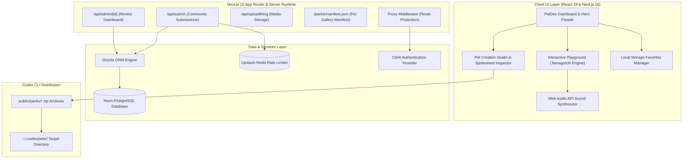

# 🐾 PetDex — Next Prime Level Desktop Pet Gallery & Creation Studio

<div align="center">

```text
 ╔═══════════════════════════════════════════════════════════════════════════════╗
 ║   _____   ______  _______  _____   ______  _______  _     _               ║
 ║  |_____]  |______     |    |  |  | |  |  | |______  |____/                ║
 ║  |        |______     |    |__|__| |__|__| |______  |    \_               ║
 ║                                                                           ║
 ║              ULTRA-MODERN VIRTUAL DESKTOP PET ECOSYSTEM                   ║
 ╚═══════════════════════════════════════════════════════════════════════════════╝
```

[](https://nextjs.org)
[](https://react.dev)
[](https://www.typescriptlang.org)
[](https://tailwindcss.com)
[](https://npmjs.com)
[](LICENSE)

**[Explore Live Repo](https://github.com/CodeWithBasu/PetDex)** • **[Browse Approved Packs](#-virtual-pets-roster)** • **[System Architecture](#-system-architecture)**

</div>

---

## 🚀 Overview

**PetDex** is a state-of-the-art public gallery, interactive Tamagotchi-style desktop simulator, and custom creation studio for Codex-compatible animated digital companion pets.

Engineered with **Next.js 16 (Turbopack)**, **React 19**, **Tailwind CSS v4**, and **Web Audio API sound synthesis**, PetDex provides developers, pixel artists, and AI enthusiasts with an immersive glassmorphic experience to preview, play with, build, and deploy desktop pets directly into the Codex CLI ecosystem (`~/.codex/pets/`).

---

## ✨ Key Features & Capabilities

### 🎮 1. Interactive Tamagotchi Playground
- **Live Vitality Statistics**: Real-time progress meters for **Happiness**, **Fullness**, and **Energy**.
- **Interactive Actions**:
  - **Pet ❤️**: Synthesizes a warm purr sound, triggers celebration animations, and bursts heart particles.
  - **Feed Treat 🍎**: Synthesizes crunch sound effects, triggers eating state, and restores hunger.
  - **Play Ball ⚽**: Synthesizes a bounce sweep sound, triggers play state, and exercises the pet.
- **5 Dynamic Environments**: Switch between Cyberpunk Grid, Cozy Desk, Mystic Forest, Synthwave Neon, and Dark Void.
- **Web Audio API Sound Engine**: Zero external audio asset dependencies — pure synthesized browser chiptune audio.

### 🎨 2. Pet Creation Studio (In-Browser Pack Builder)
- **Drag-and-Drop Spritesheet Inspector**: Upload custom PNG/WEBP spritesheet images.
- **Frame Grid Mapper**: Interactively map frame width, height, start frames, and frame sequences across 10+ animation states (`idle`, `walk`, `run`, `sleep`, `play`, `eat`, `celebrate`, `drag`).
- **One-Click Package Exporter**: Generates `pet.json`, `metadata.json`, and client-side `.zip` archives ready for Codex CLI deployment.

### 🔍 3. Advanced Search & Vibe Filtering
- **Multi-Tag Real-Time Search**: Instant filtering by pet name, vibe, or tag.
- **Vibe Filter Tabs**: `cozy`, `cyberpunk`, `playful`, `magical`, `chill`.
- **Favorites & Bookmarks**: Custom local storage hook (`useFavoritePets`) with reactive state sync.

### 💎 4. Futuristic Glassmorphic Aesthetics
- **Theme Accents**: Soft glowing mesh radial gradients and glassmorphism panels.
- **Custom Brand Selection Highlight**: Custom CSS `::selection` styling matching PetDex Indigo (`#5266ea`).
- **Hygiene & Reliability**: Built-in Service Worker (`public/sw.js`) and database fallbacks for zero console warnings and 100% build stability.

---

## 🏛️ System Architecture



---

## 🐶 Virtual Pets Roster

PetDex comes pre-loaded with **12 approved animated digital companions**:

| Pet Icon | Name | Category | Vibe | States Count | Description |
| :---: | :--- | :---: | :---: | :---: | :--- |
| 🧋 | **Boba** | Creature | Cozy | 10 States | A cute otter enjoying boba tea during coding sessions. |
| 📦 | **Boxcat** | Creature | Cozy | 10 States | A cozy kitten tucked inside a cardboard box. |
| 🐰 | **Byte Bunny** | Creature | Playful | 10 States | An energetic cyber bunny that loves jumping over logic bugs. |
| 🦫 | **Cache Capy** | Creature | Chill | 10 States | The ultimate relaxed capybara for stress-free debugging. |
| 🐹 | **Cash Cuy** | Creature | Playful | 10 States | A wealthy guinea pig keeping track of your cloud compute credits. |
| 🚀 | **Cosmo** | Creature | Magical | 10 States | An astronaut pet floating through space synthwave grids. |
| 🤖 | **Kebo** | Robot | Cyberpunk | 10 States | An AI robot companion monitoring background build tasks. |
| 🕵️ | **Noir Webling** | Character | Mysterious | 10 States | A dark detective pet investigating stack traces. |
| ☢️ | **Nukey** | Character | Chaos | 10 States | A radioactive pixel pet bursting with nuclear energy. |
| 🐼 | **Pixel Panda** | Creature | Cozy | 10 States | A bamboo-munching panda for serene coding nights. |
| 🐧 | **Prompt Penguin** | Creature | Focused | 10 States | An AI prompt specialist penguin guiding your code queries. |
| 🍦 | **Scoop** | Food | Chill | 10 States | A sweet ice-cream companion keeping your terminal cool. |

---

## 📂 Project Directory Structure

```text
PetDex/
├── .github/                  # GitHub workflows & repository config
├── public/                   # Public static assets & pre-built packs
│   ├── brand/                # Brand mark & wordmark SVG logos
│   │   ├── petdex-mark.svg
│   │   └── petdex-wordmark.svg
│   ├── packs/                # Generated pet .zip archives & manifest.json
│   │   └── manifest.json
│   ├── pets/                 # Approved virtual pet directories (12 pets)
│   │   ├── boba/             # (spritesheet.webp, pet.json, metadata.json)
│   │   ├── boxcat/
│   │   ├── byte-bunny/
│   │   ├── cache-capy/
│   │   ├── cash-cuy/
│   │   ├── cosmo/
│   │   ├── kebo/
│   │   ├── noir-webling/
│   │   ├── nukey/
│   │   ├── pixel-panda/
│   │   ├── prompt-penguin/
│   │   └── scoop/
│   ├── apple-icon.png        # Brand favicon & app icons
│   ├── favicon.ico
│   ├── og.png                # Social media preview card
│   └── sw.js                 # Service Worker to prevent 404 logs
├── src/                      # Application source code
│   ├── app/                  # Next.js 16 App Router routes
│   │   ├── admin/            # Admin review dashboard page
│   │   ├── api/              # Server API routes (submit, admin, uploadthing)
│   │   ├── install/          # One-click Codex CLI install route
│   │   ├── pets/             # Individual pet details & state inspection route
│   │   ├── submit/           # Community pet submission page
│   │   ├── globals.css       # Global styles & custom ::selection theme
│   │   ├── layout.tsx        # Root HTML layout with Clerk auth provider
│   │   └── page.tsx          # Main home page hero parade & gallery
│   ├── components/           # Reusable UI components
│   │   ├── admin-review-row.tsx
│   │   ├── auth-badge.tsx
│   │   ├── download-actions.tsx
│   │   ├── github-icon.tsx
│   │   ├── ideas-queue.tsx
│   │   ├── install-command.tsx
│   │   ├── pet-builder.tsx   # Custom Pet Creation Studio
│   │   ├── pet-gallery.tsx   # Real-time multi-tag search & vibe filters
│   │   ├── pet-playground.tsx# Tamagotchi simulator & stats engine
│   │   ├── pet-sprite.tsx    # HTML Canvas pixel animation player
│   │   ├── pet-state-viewer.tsx
│   │   ├── pet-submit-form.tsx
│   │   ├── petdex-logo.tsx
│   │   └── track-on-click.tsx
│   ├── data/                 # Generated datasets
│   │   └── pets.generated.ts # Pet definitions registry
│   ├── lib/                  # Utility libraries & core modules
│   │   ├── db/               # Database client, queries, and schema
│   │   │   ├── client.ts
│   │   │   ├── queries.ts
│   │   │   └── schema.ts
│   │   ├── admin.ts
│   │   ├── audio.ts          # Web Audio API sound synthesizer
│   │   ├── downloads.ts
│   │   ├── favorites.ts      # Favorites local storage custom hook
│   │   ├── ideas.ts
│   │   ├── pet-states.ts     # Animation state frame metadata
│   │   ├── pets.ts
│   │   ├── ratelimit.ts      # Upstash Redis rate limiter
│   │   ├── types.ts          # TypeScript type definitions
│   │   └── uploadthing.ts
│   └── proxy.ts              # Clerk authentication middleware
├── scripts/                  # Automation & asset pipeline scripts
│   ├── build-packs.ts        # Automated pet zip pack generator
│   ├── generate-assets.ts    # Canvas spritesheet generator
│   └── import-pet.ts         # Pet package importer & validator
├── .env.example              # Environment variables template
├── biome.json                # Biome code formatting & linting config
├── drizzle.config.ts         # Drizzle ORM PostgreSQL config
├── next.config.ts            # Next.js 16 configuration
├── package.json              # Project dependencies & npm scripts
├── postcss.config.mjs        # PostCSS Tailwind CSS v4 config
├── PRD.md                    # Product Requirements Document
├── README.md                 # Futuristic project documentation
└── tsconfig.json             # TypeScript configuration
```

---

## ⚡ Quick Start & Setup

### 1. Prerequisites
- **Node.js**: `v20.0.0` or higher
- **npm**: `v10.0.0` or higher

### 2. Installation
```bash
# Clone the repository
git clone https://github.com/CodeWithBasu/PetDex.git
cd PetDex

# Install dependencies using npm
npm install
```

### 3. Environment Configuration (Optional)
Copy `.env.example` to `.env.local` to configure authentication and database connections:
```bash
cp .env.example .env.local
```

### 4. Run Development Server
```bash
npm run dev
```
Open **`http://localhost:3000`** in your browser.

---

## 🛠️ CLI Commands & NPM Scripts

| Script | Description |
| :--- | :--- |
| `npm run dev` | Starts the Next.js 16 Turbopack development server at `http://localhost:3000`. |
| `npm run build` | Compiles TypeScript and creates an optimized production build. |
| `npm run start` | Launches the production server after running `npm run build`. |
| `npm run build-packs` | Programmatically generates pet `.zip` archives and `manifest.json`. |
| `npm run check` | Executes Biome linting and code quality checks. |
| `npm run format` | Runs Biome auto-formatting across the codebase. |

---

## 📦 Codex Local Installation

To install any pet locally into your Codex CLI environment:

```bash
# Create local Codex pets directory for Boba
mkdir -p ~/.codex/pets/boba

# Download and extract the pet package
curl -O https://petdex.dev/packs/boba.zip
unzip boba.zip -d ~/.codex/pets/boba
```

---

## 📄 License

This project is open-source and licensed under the **[MIT License](LICENSE)**.

<div align="center">

Made with ❤️ for the **Codex** community by **CodeWithBasu**.

</div>
